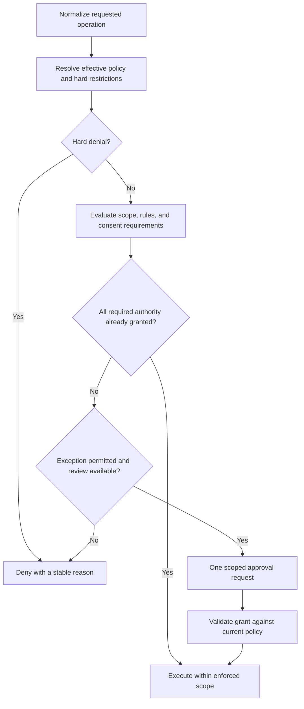

# Approval boundary migration plan

Status: implemented and locally validated on 2026-09-18. The investigation below records the
starting point; see [validation evidence](approval-boundary-validation.md) for the current
implementation, scenario evidence, and known validation limits. Existing unrelated uncommitted
changes are preserved.

Follow-on policy decision (2026-09-19): the local runtime now disables the
interactive popup queue by default to match full-auto harness behavior. An
`allow` decision executes silently; an unresolved `ask` becomes an assistant
message plus a durable inline **Deny** / **Allow once** card for interactive
tasks. This includes network/on-request access, credential use, data export, MCP
or other external side effects, eligible outside-workspace paths, and explicit
no-auto-approve requests. Automated tasks without human input, hard denials,
administrator restrictions, protected paths, OS consent, and
`approval: "never"` fail closed. `COWORK_APPROVAL_PROMPTS=on` restores the
legacy queue only for diagnostics. Pending approvals and assistant cards fail
closed on restart. The original boundary analysis below still describes the
policy engine and the opt-in legacy queue.

## Outcome

Ordinary work inside the task's granted scope must complete without approval requests: creating and editing files, producing artifacts, and running commands inside an enforced workspace sandbox. This includes CoWork-created temporary session workspaces. A user should not need to approve `write_file` merely because it changes a file.

Replace category-driven approval defaults with decisions based on the effective access profile and the actual operation. Keep a single authority for whether an action executes, is denied, or needs an eligible exception. Keep genuine external-action consent and operating-system permission requirements explicit.

Success means removing these routine requests at their source. Hiding the dialog, automatically clicking Allow, enabling Full access by default, or running an approval reviewer for every edit does not meet the requirement.

## Evidence and reference behavior

The supplied screenshot shows `Workspace change`, tool `write_file`, and a destination under `cowork-os-temp/ui-session-…/scribe-conversation.md`. Its reason exactly matches `PermissionEngine.ts`: “Default mode prompts for writes, deletes, shell, and external effects.” The screenshot identifies the policy reason, but does not supply the persisted task/profile snapshot or prove the complete runtime state.

The source establishes the main chain:

1. `src/shared/access-profiles.ts` declares `ask_for_approval` as `workspace-write` plus `on-request` with a user reviewer.
2. `getLegacyPermissionModeForAccessProfile()` maps that profile to `default`; it also maps `never` to `bypass_permissions` and automatic review to `dangerous_only`.
3. `src/electron/security/access-profile-resolver.ts` feeds this legacy mode into effective task policy.
4. `src/electron/agent/runtime/PermissionEngine.ts` makes ordinary writes ask under `default` and retains some ask results under bypass modes.
5. `src/electron/agent/runtime/ToolPolicyPipeline.ts` can require approval through permissions, workspace policy, or runtime metadata. Lower-level enforcement must be reconciled with that result.

Additional seams that make a one-branch fix insufficient:

| Location | Current responsibility / migration concern |
| --- | --- |
| `src/electron/agent/tools/shell-tools.ts:1166` | Command bundles, trusted-command settings, recent approvals, and direct daemon approval calls coexist with central policy. A call to the approval API does not necessarily display a prompt: the daemon re-evaluates it. |
| `src/electron/agent/daemon.ts:5593` | Re-evaluates requests and coordinates durable, recurring, automatic, and interactive decisions. Even immediate `allow` currently creates an approved record and emits `approval_requested`; routine authorization should instead produce a policy trace. |
| `src/electron/agent/tools/file-tools.ts:455` | External path access has its own approval/grant-consumption path; consolidate exception identity without weakening path checks. |
| `src/electron/agent/tools/edit-tools.ts:104` and `security/access-profile-paths.ts:471` | Other direct external-file requesters must return the same structured boundary requirement to the coordinator. |
| `src/electron/security/access-profile-paths.ts:361` | Canonical path/rule/protected-location enforcement; keep this authoritative at the actual file operation. |
| `src/electron/agent/tools/runtime-tool-definition.ts:197` and `tools/registry.ts:1960` | Runtime approval metadata and internally gated tools must converge on the same decision. |
| `src/electron/agent/tools/registry.ts:4073` | Legacy unregistered-tool execution has its own external-service request path; include it in the migration. |
| `src/electron/agent/runtime/PermissionEngine.ts:40` | General rule matching uses specificity before source/effect. Structural profile denials have stronger semantics than ordinary deny rules today; migration must make that distinction explicit. |

The temporary workspace initializer in `src/electron/ipc/handlers.ts` already enables read/write/delete capabilities. A temporary location is therefore not, by itself, a reason to ask on each write. Register and canonicalize the exact session root; do not whitelist all of `/var/folders` or all sibling CoWork sessions.

Codex documents automatic workspace edits and routine commands with `workspace-write`/`on-request`; approval review applies to eligible exceptions. Its approval policy is independent of sandbox scope. These are the parity targets. [Official sandbox documentation](https://learn.chatgpt.com/docs/sandboxing?surface=app).

Codex also documents connector side-effect approvals and protected paths inside writable roots. Therefore, eliminating all consent mechanisms is a different product decision from matching Codex. CoWork should eliminate routine local prompts while preserving separately defined external-action consent and administrator restrictions. [Official approvals and security documentation](https://learn.chatgpt.com/docs/agent-approvals-security).

## Target policy contract

Resolve one versioned `EffectiveAccessPolicy` at the execution boundary. Its independent dimensions are sandbox, writable/readable roots, network destinations, approval policy, reviewer, explicit rules, mandatory consent, and administrator/task restrictions. These names describe proposed contracts, not existing exported types.

The decision pipeline should be:

1. **Hard restrictions remain authoritative.** Administrator denials, tool restrictions, protected paths, unavailable/invalid profiles, read-only workers, and explicit scope ceilings cannot be overridden by an ordinary approval or model assertion.
2. **Local mutation is not an approval reason.** Normalize actual operation targets and check them against granted roots and applicable rules. Validate both source and destination for moves/copies and every output for artifact generation. Deletes retain deliberate destructive-operation policy; no blanket prompt merely because a tool is classified as mutating.
3. **Distinguish default boundaries from hard ceilings.** A path outside the ordinary workspace may be eligible for a narrow exception. A path forbidden by a custom profile or administrator remains denied. Do not turn every existing `deny` into an approvable exception.
4. **Explicit ask rules still mean ask when interactive review is enabled.** General inherited allow rules cannot defeat authoritative denials. Define and test rule specificity/source precedence, including any intentionally stricter behavior than today's rule matcher.
5. **`on-request` is boundary-based.** Allowed local work runs immediately. Requests identify a concrete missing capability, destination, scope, and reason. Shell sandbox failures must be distinguished from ordinary command failures; an arbitrary nonzero exit never authorizes an unsandboxed retry.
6. **`never` creates no harness approval request.** With the legacy queue enabled, it executes only already-authorized operations and returns a structured denial when additional authority is missing. In the default runtime, eligible requests run silently and unresolved asks use the inline assistant decision card for interactive tasks; automated tasks fail closed. Hard denials and mandatory OS consent remain separate system capabilities.
7. **The reviewer handles only real requests.** `user` and `auto-review` use identical scope and enforcement. Automatic review is not the mechanism for making allowed workspace edits silent.
8. **Permission changes take effect safely.** Capture policy versions, revalidate before execution, and revoke/restart execution contexts when roots, network rights, or parent restrictions narrow. A queued tool must not inherit a stale broader grant.

| Operation | Default bounded profile | Bounded profile with `never` |
| --- | --- | --- |
| Write/edit/generate inside the selected workspace or exact session scratch root | Execute; no approval event | Execute |
| Routine command inside a working OS sandbox | Execute | Execute |
| Already-granted network destination and operation | Execute | Execute |
| Outside default roots, eligible for a scoped exception | One scoped request | Deny with actionable reason |
| Explicit deny, protected path, unavailable profile, child widening | Deny; no request | Deny |
| Sensitive external effect requiring consent, without a matching valid grant | Dedicated consent request | Deny |
| Missing/unhealthy sandbox backend for a bounded command | Report unavailable capability; do not run unsandboxed | Same |

Browser automation, computer use, connector actions, and shell network access are separate execution surfaces. Their permissions must describe the actual resource/action; allowing one does not grant the others. Built-in search/fetch capability can be granted by configuration without authorizing arbitrary subprocess networking or external writes.

## Implementation sequence

### 1. Specify the contract and lock in the reported regression

Add a regression fixture using a canonicalized macOS temporary workspace and `scribe-conversation.md`. Exercise the named profile through resolver, policy pipeline, executor, approval coordinator, and registered file tool. Assert successful write, zero `requestApproval` calls, zero `approval_requested` events, zero review calls, and no blocked/awaiting-approval state.

Add equivalent fixtures for normal workspace edits, generated files, and narrow explicit denials. Record stable decision reason codes and policy versions in existing `ToolPolicyTrace` infrastructure. Do not collect file contents, secrets, or raw sensitive command arguments.

### 2. Stop using legacy permission modes as the runtime authority

Change `access-profiles.ts`, `access-profile-resolver.ts`, `PermissionEngine.ts`, and their callers so effective policy is passed directly. Keep legacy mode parsing only at migration/API compatibility boundaries. Changing the `default` branch alone is insufficient because network, metadata, internal tools, and daemon approvals have independent paths.

Retain current built-in profile IDs for compatibility. Update their descriptions to state actual behavior. A distinct bounded/no-prompts custom configuration must remain possible without selecting Full access. Do not carry Codex's retired selectable `untrusted` policy into new profile UI; map legacy configurations explicitly without broadening their restrictions.

### 3. Unify decision ownership and scoped grants

Make the central policy pipeline the only component that decides to request harness approval. Tool-local checks continue enforcing resources, but return structured missing-authority/deny results rather than creating a second unrelated request.

Replace blanket metadata such as `approvalRequired` with typed requirements where feasible: filesystem targets, network destination, external action, credential use, destructive operation, and explicit consent. Unknown plugin/MCP requirements remain conservative until classified; this is not permission to erase every metadata gate.

Use a grant identity bound to task/session, tool/action, normalized resource, requested effect, relevant arguments or digest, policy version, and expiry. Changed arguments, workspace/profile changes, restarted execution contexts, and revoked parent authority invalidate incompatible grants. Exact one-shot grants cannot become wildcard session approvals.

Keep existing approval IDs, persistence/audit records, concurrency handling, cancellation, timeout, and remote delivery where sound. Re-evaluation of an old queued request must never execute the side effect twice or rewrite old history into a fabricated grant.

An `allow` result records ordinary authorization evidence, not synthetic requested/granted approval events. Reserve the approval lifecycle for actual requests and consent. Existing history retains its original events; renderer projection must support both historical and new event shapes.

### 4. Prove enforcement before making command execution frictionless

Audit every process/native execution path, including persistent shell, code execution, build/document helpers, AppleScript, browser workers, and plugins. Bounded execution requires a verified backend; model reasoning and regex command classification are not a sandbox.

Filesystem checks and spawned-process policy must agree on canonical paths, symlinks, read-only subtrees, policy/configuration files, and temporary roots. Network enforcement must cover child processes and DNS/redirect behavior as appropriate, not only tool input URLs. Check each supported OS independently and expose unavailable capability accurately.

The native file-tool fix may ship independently once its path checks are proven. The general command no-prompt rollout depends on the relevant OS enforcement gate; do not claim cross-platform sandbox parity from TypeScript unit tests.

Current seams include ShellTools' sandbox availability checks and administrative escape overrides, lack of a domain-aware shell egress proxy, Docker's fail-closed handling of nested denied paths, and Docker/none fallback on platforms without a native backend. The legacy `sandbox/runner.ts` contains an unsandboxed fallback, but the executor references inspected here only construct/clean it up; establish a live execution caller before reporting it as a currently exercised bypass. Remove obsolete paths or ensure they cannot become a future alternative enforcement route.

Preserve and test the existing guards: `execute_code` rejects backend `none` without explicit Full access; Playwright QA rejects it for restricted profiles; ShellTools requires the explicit administrator-plus-environment override before falling back from a required sandbox. Persistent shells are a live direct-spawn path and require policy/grant invalidation when scope narrows. `AcpxRuntimeRunner.ts` launches an external runtime with its own environment and approval flags: treat that runtime as delegated execution requiring equivalent confinement, or as a separately configured external authority. Do not claim bounded execution there merely because `run_command` is fixed. The unused `SecurityPolicyManager` class is not the production authority to repair; its quick-access helper is used, while the active decision flow is the runtime policy pipeline.

### 5. Migrate stored policy and every entry point

Use an idempotent, versioned migration with a recoverable previous representation. Cover encrypted global permission settings, task `agentConfig`, workspace DB rules, custom profile definitions, automation templates, and pending approvals. A shared normalizer must be used by all task creators.

Current settings normalization still returns version 1. More importantly, `AgentDaemon.startTask()` accepts already-persisted tasks without attaching the current default, and the resolver intentionally treats profile-less persisted tasks as legacy. Changing the composer/default setting alone therefore leaves these direct `TaskRepository.create()` callers behind:

| New root task source | Concrete migration location |
| --- | --- |
| ACP delegation | `src/electron/control-plane/handlers.ts:2594` |
| Gateway background/inbound | `src/electron/gateway/router.ts:4591` and `:6847` |
| Tray quick task | `src/electron/tray/TrayManager.ts:524` |
| Mailbox follow-up | `src/electron/mailbox/MailboxService.ts:12311` |
| Improvement automation root | `src/electron/improvement/ImprovementLoopService.ts:345`; assign its deliberate automation/allowlist policy |
| Gateway isolated helper | `src/electron/gateway/router.ts:4463`; preserve its explicit read-only restriction |

Normalize these creators before persistence. Normal IPC/CLI/Control Plane and automation paths that already converge through `AgentDaemon.createTask()` must use that same normalizer. Managed sessions already select a profile explicitly; verify they retain their intended ceiling.

For ordinary built-in profiles, adopt corrected boundary behavior on new tasks and at a safe resume/turn boundary. Preserve custom scope ceilings, explicit denies/ask rules, read-only intent, shell-disabled legacy intent, and administrator settings. Historical tasks with only ambiguous legacy configuration should retain an explicit compatibility policy until deliberately converted; do not infer broad grants from absent fields.

Snapshot the effective legacy behavior before changing defaults, including `allowedPaths`, shell-disabled intent, applicable rules, and administrator constraints. Simply assigning a named profile to a profile-less task can discard legacy `allowedPaths` as well as alter approval behavior. A deliberate conversion must account for both retained access and retained restrictions.

Use an immutable effective policy snapshot/version for execution and explicit provenance for inherited/default/explicit configuration. Resuming or deleting a referenced custom profile cannot silently switch the task to a more permissive default. Subagents, bots, and verifiers inherit the parent's ceiling; read-only helpers remain read-only.

Validate inheritance during effective resolution as well as settings ingestion. Preserve the actual extra-root semantics: an explicit child `workspaceRoots: []` removes inherited additional roots, while the normal workspace remains accessible; it is not itself an observed runtime widening. Include empty/absent lists, cycles, missing parents, and invalid imported settings in regression coverage.

Required surfaces: desktop new task/follow-up/resume; temporary sessions; Bots/Agents Hub; child tasks; direct CLI; Electron and Node daemons; Control Plane; gateway channels; cron/routines/heartbeat; side chat and verifier helpers. Each must have a test showing the same effective behavior for the same authority.

Also cover ACP delegation, tray input, mailbox follow-ups, improvement automation, and gateway isolated helpers. Workspace manifest allow rules remain untrusted unless mirrored in local trusted storage. Migration must not promote checked-in policy text to authority, execute pending approvals, or auto-resolve them; resumed execution uses a fresh validated decision under the documented compatibility policy.

### 6. Simplify approval presentation and retire duplicate controls

Normal edits produce normal timeline activity. Remaining exceptions appear in the relevant task with a plain description of the requested additional authority, exact resource, and available scope choices. Reserve blocking presentation for actions that actually need immediate consent.

Default to one-shot or clearly bounded session grants. Move workspace/profile/recurring policy authoring to an explicit advanced flow rather than presenting all scopes on every incidental file write. Replace “Approve all for this session” as a routine workaround with deliberate profile selection; preserve old controls only during a documented compatibility period.

Update `docs/access-profiles.md`, `docs/permission-system.md`, CLI/daemon/automation documentation, tool descriptions, and agent instructions together. Remove prompt copy that tells the model all writes/shell need approval. Prompt text explains the actual policy; it never substitutes for enforcement.

## Release and acceptance gates

- **No-interruption workflows:** writing a note in a fresh temporary session, editing a project, creating a document, and running a bounded test command all finish with zero approval requests under the ordinary profile.
- **Cross-surface consistency:** repeat allowed/denied/eligible-exception cases on desktop, CLI, Node daemon, gateway, bots, scheduled jobs, and children. Unattended runs deny/report unavailable authority instead of waiting indefinitely.
- **Real boundary enforcement:** integration tests exercise symlink escape and swap, `..`, writable-root aliases, read-only subtrees, source/destination moves, sibling temporary sessions, persistent shell and descendants, network escape, protected configuration paths, and unavailable sandbox backends.
- **Grant lifecycle:** concurrent calls, double responses, expiry, cancellation, restart, changed arguments, policy narrowing, and queued legacy approvals cannot double-execute or reuse excess authority.
- **Migration:** test an older settings/task/database snapshot as well as fresh state; preserve explicit restrictions and verify idempotency, interrupted migration recovery, and rollback.
- **Required validation after implementation:** focused permission/profile/path/pipeline/daemon/renderer tests, shell/browser/network regressions, `npm run type-check`, `npm run qa:harness`, and `npm run qa:security:harness -- --fail-on-findings`. Use the production-fix eval regression gate and add this interruption scenario to the eval corpus. Finish with live Electron and headless smoke tests on each claimed platform.

Roll out with a versioned feature gate and local shadow comparisons before switching enforcement. Shadow evaluation must not emit prompts, persist grants, execute tools, or send new telemetry. Investigate every old-deny/new-allow difference before release. Rollback restores earlier decisions/settings without deleting task history or reviving revoked grants.

## Investigation validation and limitations

Initial baseline before implementation: Node 24.14.1; three focused suites passed, 56 tests total: `PermissionEngine.test.ts`, `tool-policy-pipeline.test.ts`, and shared `access-profiles.test.ts`. Those tests confirmed the original behavior, including broad prompts; the current implementation and validation are recorded above.

The initial latest development log contained `[2026-09-18T13:05:19.900Z] ... Existing CoWork OS development instance detected (PID 84752)` and startup exit 73. A fresh `npm run dev:log` successfully started the app and was stopped after inspection. It did not reproduce the original approval; no live incident-frequency or end-to-end fix claim is made. Its unrelated integration/decryption diagnostics are outside this plan.

The local Codex CLI launcher failed with a missing platform binary (`ENOENT`), so comparison uses fetched official documentation, not a local Codex experiment. Normal dev startup may update application runtime state. Existing unrelated source changes remain outside this work.
