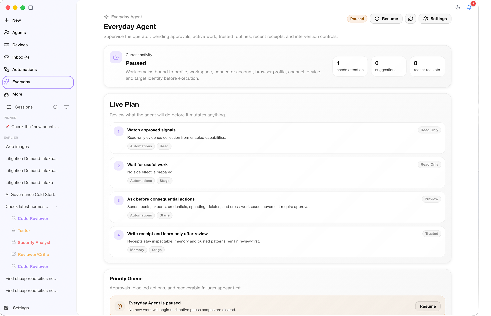
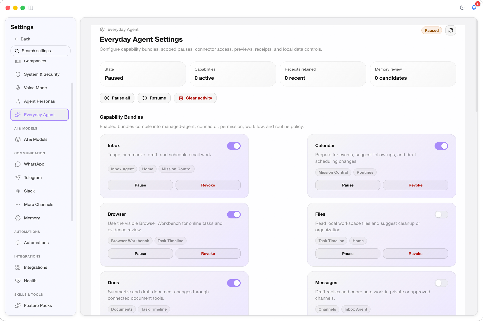

# Everyday Agent

Everyday Agent is an opt-in control, consent, trust, and observability layer over existing CoWork OS execution systems. It does not introduce a separate executor. Work still runs through Managed Agents, task timelines, Browser Workbench, Inbox Agent, Mission Control, Routines, Channels, Devices, memory, and the permission system.

## Product Surface

Open **Everyday Agent** from the sidebar. The surface shows:

- Enabled, disabled, paused, or admin-blocked state.
- Active capability bundles and their compiled policy state.
- Connected-app allowlists and scoped account state.
- Recent receipts for previews, approvals, blocks, pauses, skips, and executed actions.
- Workflow Intelligence suggestions and reviewable memory candidate count.
- Pending action preview details with risk class, target binding, affected objects, rollback flag, approval requirement, and idempotency key.
- Global and scoped pause controls for capability, connector, workspace, device, and channel.
- Local clear-data controls for receipts, previews, cached connector summaries, and browser-profile metadata.

  
   <em>Everyday Agent keeps active goals, live plan items, and priority queues visible.</em>

  
   <em>Capability settings make consent, connector scope, and automation lanes explicit.</em>

## Consent Model

The Spark-style onboarding modal is CoWork-specific:

- Local-first profile and receipt storage in the CoWork SQLite database.
- Visible Browser Workbench preference for web work.
- Reviewable memory by default.
- Scoped connector allowlists instead of global connector access.
- Explicit approval boundaries for sensitive actions.
- Data deletion through `everydayAgent.clearData`.

Declining consent leaves the profile disabled. Enabling consent creates or reuses the default Managed Agent preset named **Everyday Agent**.

## Capability Bundles

The current bundles are:

- `inbox`
- `calendar`
- `browser`
- `files`
- `docs`
- `messages`
- `github_work`
- `memory`
- `screen_context`
- `remote_devices`
- `automations`

The capability compiler maps enabled bundles into managed-agent defaults, connector policy, permission rules, workflow targets, browser behavior, and routine eligibility. Admin-denied bundles are removed even if the local profile enables them.

## Risk Classes

Every action preview is classified as one of:

- `read`
- `draft`
- `stage`
- `execute_low_risk`
- `execute_sensitive`
- `destructive`
- `data_export`
- `spend`
- `credential_sensitive`

These always require explicit approval:

- `execute_sensitive`
- `destructive`
- `data_export`
- `spend`
- `credential_sensitive`

Email sends, message posts, external-service mutations, real-browser attach, cross-workspace movement, exports, destructive actions, purchases, and credential-sensitive access remain explicit even under high-trust settings.

## Trust Patterns

Approved low-risk previews can create scoped trusted patterns. Trust is scoped by:

- profile
- capability
- workspace
- connector
- connector account
- action class
- destination

Trust never generalizes globally. Sensitive risk classes remain approval-required.

## Receipts

Receipts are persisted for action previews, blocks, approvals, pauses, revocations, and clear-data operations. Receipts include:

- profile id
- workspace id
- capability
- risk class
- source signals
- approval id
- preview id
- tool-call summaries
- external ids
- retry state
- idempotency key
- result metadata

The idempotency key prevents duplicate preview/receipt records for the same proposed side effect.

## Admin Policies

Admin policy controls live in **Settings -> System & Security -> Admin Policies**.

Everyday Agent supports:

- full feature block
- blocked capability bundles
- forced review-only mode
- heartbeat cadence cap
- concurrent background-work cap
- active-hours ceiling in policy JSON

Admin deny rules override all local profile settings.

## Failure And Recovery Behavior

Recoverable failures should surface as status or receipts rather than silent retries:

- OAuth expiration
- missing connector scopes
- connector/network failure
- remote-device disconnect
- sleep/wake or app restart
- blocked admin policy
- revoked capability
- paused scope
- partial routine failure

In-flight work must stop before the next side-effecting action after revocation or pause.

## Acceptance Checks

Manual acceptance for a complete release:

1. Open Everyday Agent from the sidebar.
2. Enable consent.
3. Toggle capability bundles.
4. Review compiled state, suggestions, memory count, and receipts.
5. Preview an action and inspect risk class, target, affected objects, rollback flag, and idempotency key.
6. Approve the preview and confirm a receipt is written.
7. Pause globally and by capability.
8. Revoke a capability and confirm previews for that capability block.
9. Clear activity data and confirm receipts/previews reset.
10. Apply admin blocked/review-only policy and confirm local settings cannot override it.
